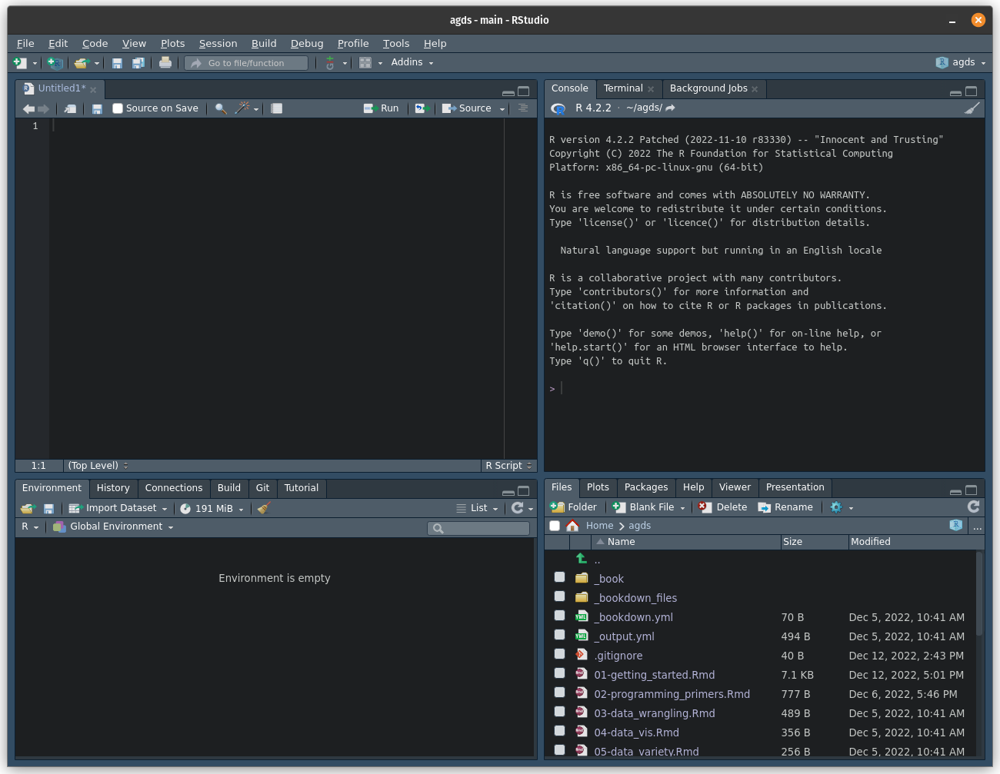
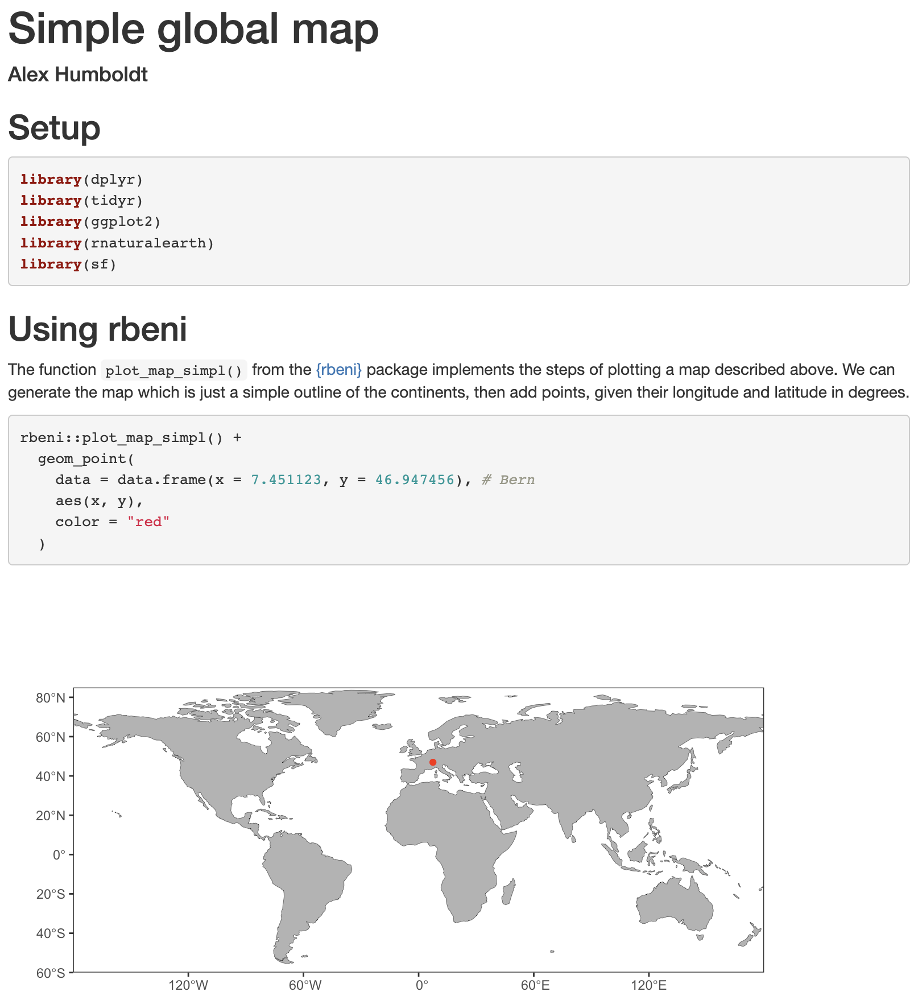
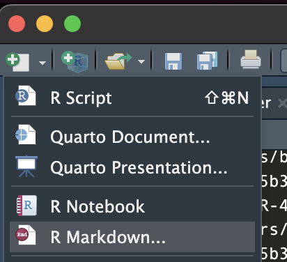
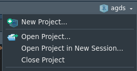

# Getting started {#gettingstarted}

**Chapter lead author: Pepa Arán**

## Learning objectives

After you've gone over the lecture and solved the exercises, you should be able to:

-   Work with R and RStudio on your computer
-   Know some R objects and basic classes
-   Understand how R interacts with files in your computer
-   Install and load R packages
-   Organize your work using R projects, scripts and R Markdown
-   Have installed and set up all the tools used throughout the book

## Tutorial

This very first chapter will give you a high level overview of the tools used throughout this book. We explain the most basic concepts for working with R (the interface, running code, relationship between code and files, R objects...), while Chapter \@ref(programmingprimers) will focus on how to code, i.e. the programming itself.

We give instructions to install R, RStudio, R packages and git, to create your GitHub account and link it to your computer, and to make these tools work with each other. The aim is not to introduce how all of them work in detail (which is done in future chapters) but to set up all the necessary infrastructure for this course at the start. We will also give some rough guidelines to organize yourself (code, files, etc) such that you can start working on exercises and save your progress efficiently, before we go deep into project management topics in Chapters \@ref(openscience) and \@ref(codemgmt).

### Working with R and RStudio

R is a free, open-source programming language and software environment for statistical computing and graphics. It is widely used, not only among statisticians and data miners for developing statistical software, but also by scientist in various domains for data analysis, visualisation, and modelling. RStudio is an integrated development environment (IDE) that provides a user-friendly "center stage" for your work in R (and Python, see [here](https://posit.co/blog/three-ways-to-program-in-python-with-rstudio/)).

#### Installing R and RStudio

To use R and RStudio, you will first need to download and install them on your computer. 

-   To install R, go to the [CRAN website](https://cran.r-project.org/) and download the latest version of R for your operating system. Once the download is complete, follow the on-screen installation instructions for your operating system to install R.

-   To install RStudio, go to the [RStudio website](https://posit.co/download/rstudio-desktop/) and download the latest version of RStudio for your operating system. Once the download is complete, follow the installation instructions for your operating system to install RStudio.

#### The RStudio interface

RStudio provides a user-friendly interface for writing, running, and debugging R code. When you open RStudio, you will see the following:

```{r label="rstudio", echo=FALSE, fig.cap="RStudio interface.", out.width="75%", fig.align='center'}

```

The interface is divided into four main panels:

-   The **source editor** is where you can write, edit, and save your R code.
-   The **console** is where you can enter R commands and see the output.
-   The **environment** panel shows you the objects (variables, data frames, etc.) that are currently in your R session, as well as their values.
-   The **files, plots, help, etc.** panel shows you the files, plots, and other items that are currently in your R workspace, as well as help and documentation for R functions and packages. We will cover this in more detail later in this course.

#### Running R code

Once you have both programs installed, you can open RStudio and begin a new *R session*. To run R code using R Studio, follow these steps:

-   In the *source editor* panel, type your R code.
-   To run the code, you can either press the **Run** button or use the keyboard shortcut Ctrl + Enter (Windows) or Command + Enter (Mac).
-   The code will be executed in the *console* panel, and any output will be displayed there.
-   Alternatively, you can directly type single-statement R commands in the console and run them by pressing Enter.

For example, let's say you want to calculate the sum of the numbers 1, 2, and 3. You can write the following code in the console or in the source editor:

```{r}
# Calculate the sum of 1, 2, and 3
1 + 2 + 3
```

If you've entered it in the console, press Enter. If you've entered it in the source editor, you can press the **Run** button or use the keyboard shortcut to run the code. The output will be displayed in the console:

        > 1 + 2 + 3
        [1] 6

#### Base R operations

The R {base} package contains the basic functions which let R function as a programming language: arithmetic, input/output, basic programming support, etc. Its contents are always available when you start an R session. Here we introduce the main binary operators, which work on vectors, matrices and scalars.

Arithmetic operators:

-   `+` addition
-   `-` subtraction
-   `*` multiplication
-   `/` division
-   `^` or `**` exponentiation

Logical operators:

-   `>` greater than
-   `>=` greater than or equal to
-   `==` exactly equal to
-   `<` less than
-   `<=` less than or equal to
-   `!=` not equal

### R objects

In addition to running single statements in the R console, the output of a statement can be saved as a new *object*. There are many kinds of R objects, some of which are covered here and in future chapters.

#### Types of data

First, we will introduce the different types of data that one can encounter. We can classify variables according to what values they take.

-   *Numerical*: These variables can be measured quantitatively and their value is a number.
    -   *Continuous*: We say that a variable is continuous when it can take an infinite number of real values within an interval. One could consider unbounded variables (height above sea level) or restricted variables, like positive variables (weight of a person) or an interval (a proportion between 0 and 1).
    -   *Discrete*: When the variable can only take a finite number of values in an interval, we say it is discrete. A common example is count data, like the population of a city.
-   *Categorical*: The values are characteristics that cannot be quantified.
    -   *Binary*: These variables have two possible values: `TRUE` or `FALSE` (a variable indicating whether the person has siblings or not).
    -   *Nominal*: They describe a name, label, or category without a natural order (for example, the name of a person).
    -   *Ordinal*: Like their name indicates, ordinal variables are categorical and follow a natural order. For example, "terrible", "bad", "neutral", "good", "great". A numerical variable can sometimes be discretized and put into categories, like dividing a person's age into age groups (bins) "toddler", "child", "teenager", "adult".

Next, we will see how these different types of variables can be treated in R.

#### Variables and classes

In R, a *variable* is a named location in memory that stores a value. To create a variable, you simply assign a value to a name using the `<-` operator (or the `=` operator, which has an equivalent role when assigning values to a variable, but `<-` is preferred). For example:

```{r}
my_variable <- 5
```

This code creates a variable called `my_variable` and assigns the value `5` to it. You can access the value of a variable or any other object by simply referring to its name, like this:

```{r}
my_variable
```

When you run this code, the value of `my_variable` will be printed to the console. Running `print(my_variable)` is an alternative syntax, using the `print()` function.

In R, every object and value has a *class* that determines how it is stored and how it behaves. For example, the `5` in our example above is a number, so its class is `numeric`. To find out the class of a value or a variable, you can use the `class()` function, like this:

```{r}
class(5)
class(my_variable)
```

The most basic classes are:

-   `numeric` (`num`) - any real number, e.g. `2.375`
-   `integer` (`int`) - integer numbers, e.g. `2`
-   `character` (`chr`) - any string, e.g., `"fluxes"`
-   `logical` (`logi`) - binary, i.e., either `TRUE` or `FALSE`.
-   `factor` (`Factor`) - categorical data, the variable can only be one of a defined number of options, e.g., one of C3, C4, or CAM (the three pathways of photosynthesis). Factors may also be given an order.
-   `function` - a set of statements organized to perform a specific task, for example `mean()`

By default, any number is coerced as `"numeric"`. So if you want an integer value to have class `"integer"`, you need to specify it like this:

```{r}
my_variable <- as.integer(5)
class(my_variable)
```

Sometimes, you need to convert the class of an object, for example turning an `"integer"` number into a `"character"`. You can do so as follows:

```{r}
my_variable <- as.character(my_variable)
my_variable
class(my_variable)
```

Note that now, the values are in quotes `"5"`. This way, R interprets it as a text and you will not be able to do any numeric calculations with it anymore.

#### Vectors

A *vector* in R is a sequence of data elements of the same class. Vectors can be created with the `c()` function, which stands for *concatenate*, i.e., to link together in a series or chain. For example, the following code creates a numeric vector:

```{r}
x <- c(1, 2, 3, 4, 5)
```

To access the elements of a vector, you can use the square bracket notation. For example, the following code retrieves the second element of the vector `x`:

```{r}
x[2]
```

You can also use the square bracket notation to extract a sub-vector from a larger vector. For example, you can extract the second to fourth elements of the vector x:

```{r}
x[2:4]
```

Another useful property of vectors in R is that they can be easily combined using arithmetic operators. For example, adding the elements of two vectors `x` and `y` element-wise:

```{r}
x <- c(1, 2, 3)
y <- c(4, 5, 6)
x + y
```

R also supports vectors of other classes, for example character vectors. Since all elements must be of the same class, the most general class will be adopted. The following code concatenates the vectors `x` and `y`, followed by new character elements:

```{r}
z <- c(x, y, "seven", "eight")
z
class(z)
```

Operations on vectors are performed element-wise. For example, if we ask what numbers in `x` are greater than 2, we obtain a vector of logical values (and class `"logical"`):

```{r}
x > 2
```

Vectors that contain sequences of numbers are often needed in programming. They are easily created in R, e.g., by:
```{r}
1:10
```

More flexibility is offered by the `seq()` function:
```{r}
seq(from = 0, to = 10, by = 2)
```

Often, we need to evaluate multiple elements in a vector. We've learned that the operator `>` tests whether the value left to it is greater than the value on its right and returns a logical. We can subset a vector based on a vector of equal length that contains logicals.
```{r}
x > 1
x
x[x > 1]
```

We can also determine the *indices* (positions of elements in the vector) that evaluate to `TRUE`, or that have the lowest value:
```{r}
which(x > 1)
which.min(x)
```

#### Lists

*Lists* are R objects, of class `"list"`. They are a bit like vectors, but more flexible. They allow us to store different types of data, even if they are of different lengths or of different classes. They are created with the function `list()` and can be named or not. Here is an example where each element of the list is named.

```{r}
mylist <- list(
    temperatures = c(2.234, 1.987, 4.345), 
    my_favourite_function = mean, 
    my_favourite_course = "Applied Geodata Science"
    )
```

Similar to vectors, we can extract elements from lists, either by index `[[1]]` or by the name using `[["temperatures"]]` or `$temperatures`. Note the double `[[]]` here, indicating an element of a list as opposed to `[]` indicating an element of a vector. To get the entire vector of temperatures, do either of the three:

```{r}
mylist[[1]]
mylist[["temperatures"]]
mylist$temperatures
```

Note below how, if we index the list like we would index a vector, a list with just one element would be returned, rather than the element itself. `[` is used to subset a list (and a list is returned). In contrast, `[[` or `$` extract a single element from a list. A thorough explanation of these differences is given [here](https://r4ds.hadley.nz/base-r#sec-subset-many) and [here](https://r4ds.hadley.nz/base-r#sec-subset-one).

```{r}
mylist[1]  # returns a subset of the list as a new list
mylist[[1]]  # extracts the first element of the list (a vector)
```

To get the first temperature value, which is an element of the vector (at the same time an element of the list), we can run:

```{r}
mylist[["temperatures"]][1]
```

You can also append elements to the list (either way is possible):

```{r}
mylist[["my_second_favourite_function"]] <- median
mylist$my_second_favourite_function <- median
```

This was a very condensed introduction to vectors and lists. A more complete introduction is given [here](https://r4ds.had.co.nz/vectors.html).

#### Data frames

A *data frame*, an object of class `"data.frame"`, is essentially a table, consisting of named columns and rows. A data frame can be created as follows:

```{r}
df <- data.frame(name = c("Maria", "Peter", "Alex", "Charlie"),
                 age = c(13, 56, 30, 42),
                 is_married = c(FALSE, TRUE, TRUE, FALSE))
df
```

A data frame can also be understood as a list of vectors of equal length, whereby each vector vector makes up a column and each of these vectors (columns) contains values of the same type. This notion makes it also evident that the elements of a data frame can be accessed the same way like we access elements of lists. To get the vector corresponding to the column named `age`, we can do:

```{r}
df$age
```

Data frames can be also be treated as a *matrix*. Note that the first index refers to rows and the second to columns. For example:

```{r}
df[, 1]   # first column (returns a vector)
df[2, ]   # second row (returns a data frame)
df[2,2]   # age of Peter (returns a scalar)
```

The method of selecting parts of a data frame by index is quite flexible. For example, we may require the information in the third column for the first three rows. Putting a colon between two numbers, e.g. `[1:3,]`, indicates we want to select the rows numbers starting at the first and ending with the second number. So here `[1:3,]` will give us rows one, two and three. This can be combined with subsetting for the other dimension as well:

```{r}
df[1:3, 3]
```

To reduce the data frame to fewer columns/rows that are not contiguous, the function `c()` is used. This outputs the data frame reduced to the selected row or column numbers inside `c()`. Another method is to select the columns by column names, i.e. giving as input a string vector with the name of each column we want to select. For example, the following commands give the same output:

```{r}
df[, c(1,3)]                   # select by column index
df[, c("name", "is_married")]  # select by column name
```

There are several base R functions to help you understand the structure of a data frame. Here is a non-exhaustive list of of them:

-   Size
    -   `dim()` - Returns the dimensions of an object (here: number of rows and columns).
    -   `nrow()` - Returns the number of rows of an object.
    -   `ncol()` - Returns the number of columns of an object.
-   Content
    -   `head()` - Returns the first 6 rows.
    -   `tail()` - Returns the last 6 rows.
    -   `View()` - Opens a window in the source panel in RStudio where you can look at the entire data set in the form of a table.
-   Names
    -   `names()` - Returns the column names (for `data.frame` objects it is synonymous to `colnames()`).
    -   `rownames()` - Returns the row names.

For example, the data frame `df` has 4 rows and 3 columns:

```{r}
dim(df)
```

There are many more things you can do with data frames. Since they are central to analyzing data with R, we have dedicated all of Chapter \@ref(datawrangling) to teach you how to work with data frames in a tidy way with the [{tidyverse}](https://www.tidyverse.org/) collection of packages.

#### Functions

R *functions* can be applied to an object (or several objects) and return another object. For example, the `mean()` function can take a numeric vector as input and output the mean of its elements.

```{r}
mean(df$age)
```

Functions are also R objects and have class `"function"`. Writing your own functions is an essential part of good programming and will be introduced in Chapter \@ref(programmingprimers).

#### Missing values

R has two representations for missing values: `NA` and `NULL`. Similar objects also exist in other programming languages.

`NA` is an identifier to mark missing data and stands for *not available*. You will encounter this when reading data into a data frame, and some of its cells show `NA` because that value is missing. Also, if you ask for the fourth element of a vector of length 3, R returns `NA`.

```{r}
x[4]
```

In general, operations on vectors that contain at least one `NA` value return `NA`. For example:

```{r}
mean(c(1, 2, NA))
```

To remove all missing values in the function evaluation, the common argument to set in the respective function call is `na.rm`. By default, it is usually set to `FALSE`, but we can do:

```{r}
mean(c(1, 2, NA), na.rm = TRUE)
```

Furthermore, `NA` counts as an element in vectors. A variable assigned just `NA` would have length 1 (of class `"logical"`) and the vector above has length 3, as can be determined using the `length()` function, and has class `"numeric"`.

By contrast, `NULL` is the R null object or empty space. You can also assign `NULL` to a variable, which will then have length zero because it is empty. Functions may return `NULL` when no output was defined, or if an error occurred.

#### R environment

The set of objects (variables, data frames, etc.) defined during an R session are referred to as the *environment*. You can view the objects in RStudio in the **environment** panel in R Studio, grouped as Data, Values and Functions.

After closing an existing R session (e.g., after quitting RStudio), the environment defined by the used during that session will not be saved automatically and will be lost. To save your environment, go to the **Session** menu and select **Save Workspace As...**. This will save all your objects in a `.RData` file in your working directory. 

The *working directory* is the default location to which R writes to and reads files from. You can check what your current working directory is running `getwd()` in the command line.

However, this workflow is not recommended. Next, we will go over some more sophisticated ways of writing code and saving your progress.

#### Read and save objects

The function `save()` allows to save multiple R objects of any form as a single `.RData` file. This is how the environment of your R session is saved. This is how we would save several R objects:

```{r eval=FALSE}
save(df, df_small, file = "./data/data_frames.RData")
```

To tell the function where the data is located, pass the data's path as an argument. You can either use an *absolute path*, starting from `C:/` on a Windows computer or `~/` on a Mac or Linux. Or, alternatively, you can provide a *relative path*, where `./` points to the present working directory (like above) and `../` is one level up, or `../../` is two levels up, etc. We recommend that you work with R projects and use relative paths, because the working directory is set to the root directory of the R project and relative paths will also work on another person's computer, helping with reproducibility.

`.RData` files are read into your environment using the `load()` function. This function loads the objects with the name that they were saved with.

```{r eval=FALSE}
load("./data/data_frames.RData")
```

Alternatively, the function `saveRDS()` allows you save single R objects that can then be read into with a specific (potentially new) variable name. This is more transparent than using `save()` and `load()` and gives the user more control.

```{r, eval=F}
saveRDS(df_small, file = "./data/df_small.rds")
df_small_2 <- readRDS("./data/df_small.rds")
```

`save()` and `saveRDS()` create *binary* files that are fast to write and read, but only intelligible to R (and not to the human eye). Such files are commonly identified by the suffix `.rds`. It is recommended to name the `.rds` files according to the single object they contain. When publishing and sharing data, follow Open Science principles (Chapter \@ref(openscience)) and avoid file formats that are not readable across different platforms and programming languages. 

We will learn more about human-readable tabular data files like CSV in Chapter \@ref(datawrangling) and other open source binary file formats in Chapter \@ref(datavariety).

### Libraries

*Packages*, sometimes called *libraries*, are collections of R functions, data, and complied code in a well-defined format. R comes with a standard set of packages (including {base} R, {utils}, {stats}...) and other packages targeted for specific applications are available for download and installation. Once installed, you need to load them each time you start a new R session to use them.

For example, the {tidyverse} package is used for data wrangling and will be covered in this course. This is a special package which loads many other packages in the background (like {readr}, {ggplot2}, etc.). You can install a new package as follows:

```{r eval=FALSE}
install.packages("tidyverse")
```

Then, you can load it with the following code. Note that now the name of the package is not in quotation marks.

```{r eval=FALSE}
library(tidyverse)
```

You can now use the functions and features provided by the {tidyverse} package in your R scripts.

At any time, you can see a list of your installed packages on the source panel with the following command:

```{r eval=FALSE}
library()
```

And a list of the packages currently loaded:

```{r}
search()
```

This information can also be found on the **Packages** panel in RStudio. The loaded packages are shown with a tick mark.

#### Installation of required packages

Finally, let's install all the missing packages and load all required packages for this course:

```{r message=FALSE, warning=FALSE}
use_pkgs <- c("dplyr", "tidyr", "readr", "lubridate", "stringr", "purrr",
              "ggplot2", "tidyverse", "visdat", "terra", "hexbin", "jsonlite",
              "MODISTools", "forcats", "yardstick", "recipes", "caret",
              "broom", "skimr", "cowplot", "scico", "hwsdr", "usethis",
              "renv", "rsample", "modelr", "rmarkdown", "rpart",
              "rpart.plot", "ranger", "sessioninfo")
new_pkgs <- use_pkgs[!(use_pkgs %in% installed.packages()[, "Package"])]
if (length(new_pkgs) > 0) install.packages(new_pkgs)
invisible(lapply(use_pkgs, require, character.only = TRUE))
```

#### Other libraries and applications

For this course, we will also need software that is not available as an R package. To work with other libraries and applications, you may need to install additional software on your computer.

For example, to work with *netcdf* files in R, you would need to install the {ncdf4} library and the `netCDF` command-line tools:

-   To install the {ncdf4} library, follow the same steps as above for installing an R library.
-   To install the `netCDF` command-line tools, follow the instructions on the [netCDF website](https://www.unidata.ucar.edu/downloads/netcdf/index.jsp).
-   Once the {ncdf4} library and the `netCDF` command-line tools are installed, you can use them to work with `.nc` files in R. For example, you could use the `nc_open()` function from the `"ncdf4"` library to open a file.


### R scripts

Usually, multiple statements are needed to get, e.g., from reading data into R to final numbers and figures that make up a further analysis. Together, these multiple statements constitute a *workflow*. It is essential that all workflows that underlie results of publications are *reproducible*, that is, that another person can replicate your results using your code and certain data.

To make a workflow reproducible, the sequence of statements that you needed to carry out your analysis and produce outputs can be saved as an R *script*. A script is a text file named with the suffix `.R` to indicate that it is executable by R. It contains a sequence of R commands, which you can be executed, line by line, starting from the top.

To create a new script in RStudio, go to the **File** menu and select **New File \> R Script**. This will open a new script file in the source editor. You can then type your R code in the script file and save it to your computer.

To run a script, you can either use the **Source** button in the source editor or use the keyboard shortcut Ctrl + Shift + Enter (Windows) or Command + Shift + Enter (Mac). This will run all of the commands in the script file, in the order they are written, in the console. Alternatively, you can type into the console:

    > source("my_r_script.R")

Note that, to be able to run the code above, the file `my_r_script.R` must be in your current working directory. You must always specify the path to the file, also when sourcing code.

### R Markdown

[R Markdown](https://rmarkdown.rstudio.com/) files are an enhanced version of scripts. They combine formatted text and executable code chunks. They can either be compiled (*knitted*) into an HTML or PDF output, where code chunks are executed upon compilation and visualization outputs are directly placed into the output, or they can be run like a script entirely or each code chunk separately. Rmarkdown is ideal for **reporting**, i.e., writing your final document presenting your analysis results. When opened in RStudio, RMarkdown files appear in the Editor like this:

```{r label="rmarkdown", echo=FALSE, out.width="75%", fig.cap="R Markdown document opened in the source panel.", fig.align='center'}
knitr::include_graphics("./figures/rmarkdown_editor.png") 
```

As shown in Fig. \@ref(fig:rmarkdown), an RMarkdown file consists of a header that specifies the document properties, such as how it should be rendered (as an html page, a docx file or a pdf).

```bash
---
title: "Simple global map"
author: Alex Humboldt
output: html_document
---
```

Below the header follow the contents as either text or code *chunks*. Text is formatted using the [Markdown syntax](https://www.markdownguide.org/). Nice brief guides are provided [here](https://commonmark.org/help/) or [here](https://github.com/adam-p/markdown-here/wiki/Markdown-Cheatsheet). For example, a top-level section title is specified by `#` and a title of a section one level lower by `##`.

Code chunks that contain executable R code are opened by a line ` ```{r} `. 

The document can be rendered by calling `rmarkdown::render()` on the command line or hitting the **Knit** button in the RStudio IDE. Depending on your settings a html file, pdf or docx file will be generated in your current directory (and or displayed in the IDE viewer). The RMarkdown source file shown in Fig. \@ref(fig:rmarkdown) is rendered to:

```{r label="rmarkdownrender", echo=FALSE, fig.cap="Rendered HTML output.", out.width="75%", fig.align='center'}

```

Note that the code chunk produced a figure as an output which was placed directly in the rendered html. This demonstrates the usefulness of RMarkdown as *notebooks* to document entire workflows and make their outputs reproducible. 

To create a new RMarkdown file, select from the drop-down menu in the top-left corner of RStudio as shown below:
```{r label="newrmarkdown", echo=FALSE, fig.cap="Create a new RMarkdown file", out.width="25%", fig.align='center'}

```

### Workspace management

Using *R projects* in combination with *Git* is the essence of efficient workspace management in R. All files that belong together are organised within one directory. This can be regarded as the project directory and is typically congruent with what belongs to the respective Git repository. By keeping an organized workspace, another person (or your future self) can find relevant files, run your code and reproduce your analysis workflow easily.

#### Installing Git

*Git* is a version control system (covered in detail in Chapter \@ref(codemgmt)) which is integrated in RStudio. Code repositories can then be hosted in the cloud, for example in [GitHub](https://github.com/). To use it later in this course (and throughout your career), let's set up these tools:

-   First, follow the Git download and installation instructions for your OS outlined [here](https://git-scm.com/downloads).
-   Once Git is installed, set up RStudio for version control by going to **Tools \> Global Options \> Git/SVN** and tick "Enable version control interface...". You can check that the path to your Git installation is correct.
-   If you don't have one already, create a GitHub account on <https://github.com> and sign in.
-   Connect your GitHub account with Git locally, using SSH keys. You should sequentially follow the instructions to [check for existing SSH keys](https://docs.github.com/en/authentication/connecting-to-github-with-ssh/checking-for-existing-ssh-keys), [generate a new SSH key](https://docs.github.com/en/authentication/connecting-to-github-with-ssh/generating-a-new-ssh-key-and-adding-it-to-the-ssh-agent), [add a new SSH key to your GitHub account](https://docs.github.com/en/authentication/connecting-to-github-with-ssh/adding-a-new-ssh-key-to-your-github-account) and finally [test your SSH connection](https://docs.github.com/en/authentication/connecting-to-github-with-ssh/testing-your-ssh-connection). Note that, at the top of these websites, there's an option to choose your OS because the steps vary depending on the type of computer your work with.

Now you should be able to use Git in the **Terminal** panel in RStudio, whenever your R Project is also a repository. As mentioned above, we will start working with these tools in a few weeks and they will be a crucial part of the course.

#### R projects

RStudio also allows you to work with R projects. An *R project* is basically a folder, containing a collection of files and folders that you use for a specific analysis or data project. An R project makes it easier to organize and manage your files and keep track of your work. 

To create a new R project, go to the **File** menu and select **New Project...**. This will open the *New Project* dialog, where you can choose where to save your project and what type of project to create. The current project that you are working on is shown on the upper right corner of the RStudio interface. Here you can also switch between existing projects or create a new one.

```{r label="projectmenu", echo=FALSE, fig.cap="R project menu.", out.width="25%", fig.align='center'}

```

When starting a new project, named `project_name`, a file `<project_name.Rproj>` is created. It sits in the project directory (folder) and stores information about your last session (settings, open files, etc.) and optionally (not recommended) the environment of that session. The use of R projects also automatically enables useful features in RStudio for easy package, website, or book building and lets you manage Git for the repository corresponding to the project.

When you want to continue working on an existing R project, you can start a new session by clicking on your `project_name.Rproj` file. This restores settings from your last R session, including the variables in your environment, and sets your working directory to the project directory. Nevertheless, we recommend to start by emptying your environment and loading your data and variables using the code you previously wrote. That way, you ensure that your results are reproducible.

Once you have created an R project, you can create new scripts and other files within the project. These files will be organized in a folder structure, which you can view and manage in the **files, plots, help, etc.** panel.

For example, you can keep source files where R functions are defined in `./R` (where . refers to the current project directory), data files in `./data` and visualizations in `./fig`. It's advisable to write output files, created by the code of your project, to sub-directories within the project directory. To read and write from/to files you should use relative paths (relative to the project's root directory), like any of the two equivalent following options:

    > source("./R/my_r_script.R")
    > source("R/my_r_script.R")

A project directory should only contain code, data and outputs that belong to this one project. We'll talk about using R Projects in Chapters \@ref{openscience} and \@ref{codemgmt}, as well as other methods to keep your workflow well structured and reproducible.

## Exercises

### Dimensions of a circle {-}

- Given the radius of a circle `r`, write a few lines of code that calculates its area and its circumference. Run your code with different values assigned to `r`. 
- Print the solution as text.

> *Hint*: Enter `pi` in your console.

> *Hint*: Entering `print("agds")` in your console returns `"agds"`. Combining (concatenating) multiple strings into a single one can be done using `paste()`.

### Sequence of numbers {-}

Generate a sequence of numbers from 0 and $\pi$ as a vector with length 5.

> *Hint*: Consult the manual of the function `seq()` by entering `?seq` in your terminal.

### Gauss sum {-}

Rumors have it that young Carl Friedrich Gauss was asked in primary school to calculate the sum of all natural numbers between 1 and 100. He did it in his head in no time. We're very likely not as intelligent as young Gauss. But we have R. What's the solution?

Gauss calculated the sum with a trick. The sum of 100 and 1 is 101. The sum of 99 and 2 is 101. You do this 50 times, and you get $50 \times 101$. Demonstrate Gauss' trick with vectors in R.

### Magic trick algorithm {-}

Define a variable named `x` that contains an integer value and perform the following operations in sequence:

- Redefine `x` by adding 1.
- Double the resulting number, over-writing `x`.
- Add 4 to `x` and save the result as `x`.
- Redefine `x` as half of the previous value of `x`.
- Subtract the originally chosen arbitrary number from `x`.

Print `x`. Restart the algorithm defined above by choosing a new arbitrary natural number.

### Vectors {-}

Print the object `datasets::rivers` and consult the manual of this object.

- What is the class of the object? 
- What is the length of the object?
- Calculate the mean, median, minimum, maximum, and the 33%-quantile across all values. 

> *Hint*: If you don't know how to solve a problem, help yourself on the internet.

### Data frames {-}

Print the object `datasets::quakes` and consult the manual of this object.

- Determine the dimensions of the data frame using the respective function in R.
- Extract the vector of values in the data frame that contain information about the Richter Magnitude.
- Determine the value largest value in the vector of event magnitudes.
- Determine the geographic position of the epicenter of the largest event.

### RMarkdown {-}

Create an RMarkdown file and implement your solutions to above exercises in it. Give the file a title, implement some structure in the document, and write some text explaining what your code does.

