# Code management {#codemgmt}

**Chapter lead author: Koen Hufkens**

## Learning objectives

In this chapter you will learn how to manage your code with common version control tools, i.e., *git.*

You will learn how to:

-   Create a git project (new or from a template)
-   Track changes in your code project
-   Collaborate with others
-   Ensure reproducibility of your project by openly sharing your work and progress.

## Tutorial

Code management is key for managing any data science project, especially when collaborating. Proper code management limits mistakes, such as code loss, and increases efficiency by structuring projects.

In this chapter, we will discuss the management of code in both the location sense, where things are kept, and tracking temporal changes over time using a version control system.

Current version control of code is dominated by the software tool *git*. However, version control has a long history and can be found not only in code development practices. For example, whenever you use track changes in a text document, you apply a form of version control. That is, you track changes in your text over time and selectively accept changes. In this respect, *git*, as a tool for version control of code, does not differ much from track changes of a text document. In contrast to track changes in a text document, with *git* the user has manual control over *staging* and *committing* edits on a file.

```{r label="gitworkflow", echo=FALSE, fig.cap="The git workflow- by Paola Corrales and Elio Campitelli"}
knitr::include_graphics("https://eliocamp.github.io/reproducibility-with-r/materials/day2/02-git/images/file_cycle2.png")
```

*Git* allows for the collaboration of multiple contributors on the same code and manages the integration of contributions into the repository. Built upon *git* are cloud-based platforms such as [GitHub](https://github.com), [GitLab](https://gitlab.com), [Codeberg](https://codeberg.org), or [Bitbucket](https://bitbucket.org/) which make these collaborative decisions and operations even easier.

```{r label="githubworkflow", echo=FALSE, fig.cap="The github remote workflow- by Paola Corrales and Elio Campitelli"}
knitr::include_graphics("https://eliocamp.github.io/reproducibility-with-r/materials/day2/02-git/images/local_remote.png")
```

In this chapter, you will learn how to use *git* and GitHub to manage your project and collaborate on code.

> NOTE: Coding style, and documentation practices of the code itself have been covered previously in Chapter \@ref(programmingprimers). Although the tutorial below focuses on GitHub, the jargon and operations are transferable to other platforms such as [GitLab](https://gitlab.com) and [Codeberg](https://codeberg.org).

### Git and local version control {#gitworkflow}

*Git* allows for the tracking of changes in code (or any file) within a git project. A *git* project is defined by the topmost directory in which a *git* project is created. For example, the following project is not tracked for changes using git.

``` bash
project/
├─ YOUR_PROJECT.Rproj
```

You can start tracking a project by initiating a local *git* repository using the following code in R. We'll use the {usethis} package to make some of the setup a project easier.

```{r eval=FALSE}
usethis::use_git()
```

This will create a *git* repository in your project. It will also create a `.gitignore` file which specifies which files NOT to track (even if asked to). In addition it will make an first commit.

#### git add

Before we can track anything, we need to tell *git* which files to track. In *git*-speak, we *stage* the files. We therefore have to `add` them to an index of tracked files. You can either do this on the command line using:

``` bash
git add your_file.csv
```

Or using the RStudio **Git** panel. In this panel, you will see all un-tracked files or directories highlighted with a yellow question mark.

```{r label="unstagedfiles", echo=FALSE, fig.cap="Unstaged files in a git enabled R project.", out.width="80%", fig.align='center'}
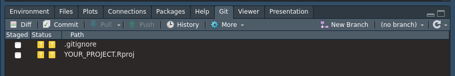
```

You select the file tick boxes to the left to stage all files for inclusion into the *git* repository. Once staged, the next step will be to finally commit these staged files to be included in *git* tracking.

```{r label="stagedfiles", echo=FALSE, fig.cap="Staged files in a git enabled R project.", out.width="80%", fig.align='center'}
knitr::include_graphics("./figures/git_staged_files.png")
```

#### git commit

To store any changes to the files which were staged we need to `commit` these changes. We therefore hit the commit button. A new window will pop up.

```{r label="commitmessage", echo=FALSE, fig.cap="Entering a commit message.", out.width="80%", fig.align='center'}
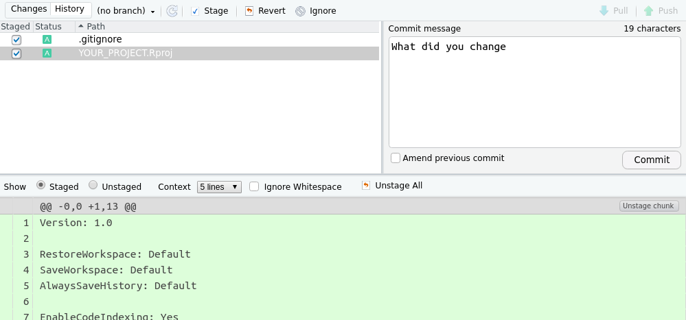
```

Each commit needs a brief message describing what you have included in the staged files, or the commit message, as shown in the panel on the right. You need to provide this small message before pressing the commit button once more. This will let *git* track the changes to these files. A message will be shown if the commit is successful.

```{r label="commitcompleted", echo=FALSE, fig.cap="A completed commit.", out.width="80%", fig.align='center'}
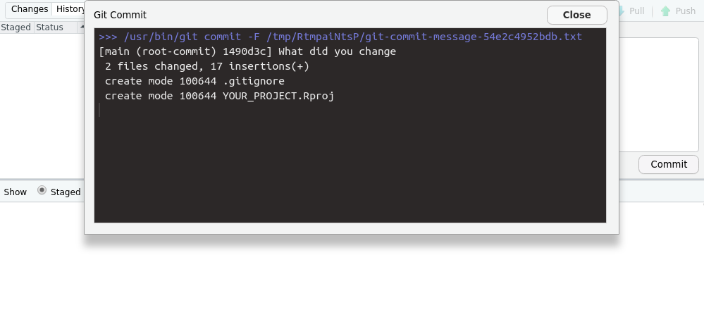
```

With this, you will track all files locally. Any new changes to a file will need to be committed to the *git* repository once more. So, unlike cloud services such as Dropbox, your files are not automatically tracked. Instead, this is a manual step. As with normal documents, you are advised to save (commit) your changes to your project frequently. And remember, if you create a new file, you will need to `add` it before you can `commit` it.

You can `commit` changes of staged files using the command line as well using the following command.

``` bash
git commit -m "A message""
```

### Remote version control

Keeping files and working with *git* locally limit the extent in which you can collaborate with others. This is where remote cloud-based *git* solutions, such as [GitHub](https://github.com), [GitLab](https://gitlab.com) and [Codeberg](https://codeberg.org), come in. They provide a cloud-based *git* repository which you can associate with your local project (see figure above).

To create a remote project and successfully associate it with an R project, we first have to specify some details, such as the user name and email you used is singing up for [GitHub](https://github.com). To not leave your R session, you can use the {usethis} package for this.

``` r
# Configure your project
library(usethis)
usethis::use_git_config(user.name = "Jane Doe",
               user.email = "jane@example.org")
```

For security reasons, the use of your GitHub password is not allowed in remote actions. You therefore need to generate a personal access token (PAT) which can be restricted in time and functionality. To proceed, first generate a GitHub PAT using [these instructions](https://docs.github.com/en/authentication/keeping-your-account-and-data-secure/creating-a-personal-access-token#creating-a-personal-access-token-classic).

To create a new project on GitHub, hit the "+" sign top left on the GitHub main page (once logged in), and select the "new repository" from the dropdown menu.

```{r label="newgithubrepo", echo=FALSE, fig.cap="Create a new github repository", out.width="30%", fig.align='center'}
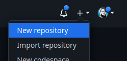
```

A new interface will open up in which you should not use any template, but specify your own project name and brief description. Make sure your project is public, and all other settings are kept as is before you hit the "Create repository" button.

```{r label="newgithubsettings", echo=FALSE, fig.cap="Set the github project name", out.width="60%", fig.align='center'}
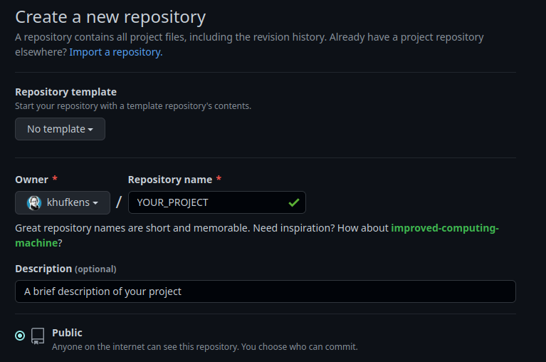
```

Note the URL that is generated for your project. You will need it when creating a new RStudio project linked to GitHub.

```{r label="githubsetup", echo=FALSE, fig.cap="A repository link you need during the R project wizard", out.width="80%", fig.align='center'}
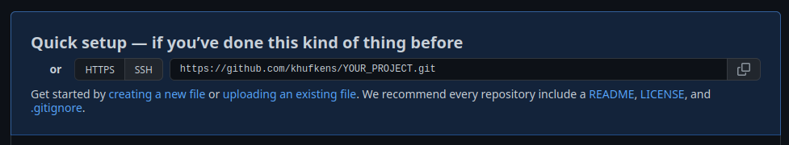
```

Next, we'll setup an R project which is associated with the repository. Use: File \> New Project \> Version Control \> Git.

```{r label="projectwizard", echo=FALSE, fig.cap="Linking the github project to a new git enabled R project", out.width="40%", fig.align='center'}
knitr::include_graphics("./figures/git_project_wizard.png")
```

In the "repository URL", paste the URL of your new GitHub repository. In the example above, this would be `https://github.com/khufkens/YOUR_PROJECT.git`. Select a location where to store the project, select the "Open in new session" option and click "Create Project". A window will pop up, asking for your GitHub username and a password. This password is *not* your GitHub login password but the PAT described above. After entering your credential, RStudio creates a `\*.Proj` file as well as a `.gitignore` file (Section \@ref(git-add)). You can add both files as you would otherwise (see Section \@ref(git-add)), and these files are tracked locally.

#### git push

Once a remote git service has been configured, you can push your local *git* repository to this remote repository, i.e. syncing both. You can use both the push buttons in the RStudio panel for this or the command linen using `git push`. At the end of a day or a session, it is always advised to `push` your changes to your remote repository to store any changes.

```{r label="remotegithubworkflow", echo=FALSE, fig.cap="Remote git workflow - by Paola Corrales and Elio Campitelli"}
knitr::include_graphics("https://eliocamp.github.io/reproducibility-with-r/materials/day2/02-git/images/pull-request.png")
```

> NOTE: Syncing between GitHub and your local repository is a manual task. If not performed the repository, it will not be synced. To retain all your changes, sync both repositories often!

#### git pull and merge conflicts

`git pull` compares your local *git* repository with the remote one and integrates the more recent changes if there are any. Note that if you make changes on the same line in file on both sides, i.e., in the remote (e.g., by another person) and in the local repository at the same time, you will generate a *merge conflict*. A merge conflict states that the remote and local changes can't be reconciled without supervised intervention on your part. Changes will be made to your local repository, but the files will include the below syntax for highlighting conflicting differences.

``` bash
    <<<<<<<<<<
    Edited line from remote
    ==========
    Edited same line locally
    >>>>>>>>>>
```

You will need to remove the \<\<\<, === and \>\>\> brackets and retain the changes you want to keep for resolving the conflict. Then, commit the changes again.

#### git clone

You can create a local copy of your remote repository that's hosted on GitHub using the `git clone` command. For example, on the command line, you can use:

``` bash
# create a local copy of the remote github repository
git clone git@github.com:khufkens/YOUR_PROJECT.git
```

You can then start working on this repository by using the modify -\> staged -\> commit -\> push workflow.

#### git fork and pull request

You can also create a copy of any public GitHub project from into your own GitHub account by creating a *fork*. You can create a fork of a project by clicking the **fork** button top right on any public GitHub project page. The number of forks of a project is displayed next to the button. In case of the {rpmodel} package there are currently 24 forks of the project.

```{r label="creatingforks", echo=FALSE, fig.cap="Creating a fork of an existing project (rpmodel)", out.width="80%", fig.align='center'}
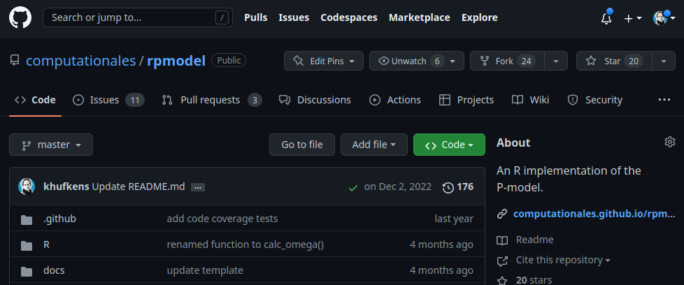
```

You can give the forked project a new name and description if so desired.

```{r label="forksettings", echo=FALSE, fig.cap="Github fork settings", out.width="60%", fig.align='center'}
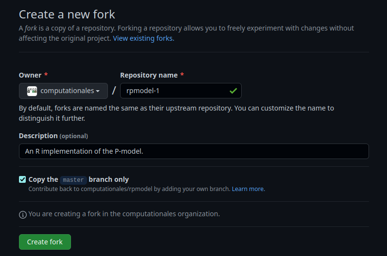
```

A fork allows you to experiment with the code stored in the original project without affecting the original repository. However, the relation to the original project is maintained. If you want to contribute changes to the original project you can do so with a **pull request**.

> NOTE: To make changes to a forked project, you will first have to `clone` it to your local system. See workflow above.

In a forked project, go to the **Pull requests** tab and click the green **New pull request** button. You will then have to provide a description of the changes you made. This information will be forwarded to the original owner of the project, who can accept these changes and accept the pull request and "pull" in the changes.

```{r label="pullrequest", echo=FALSE, fig.cap="Creating a new github pull request", out.width="60%", fig.align='center'}
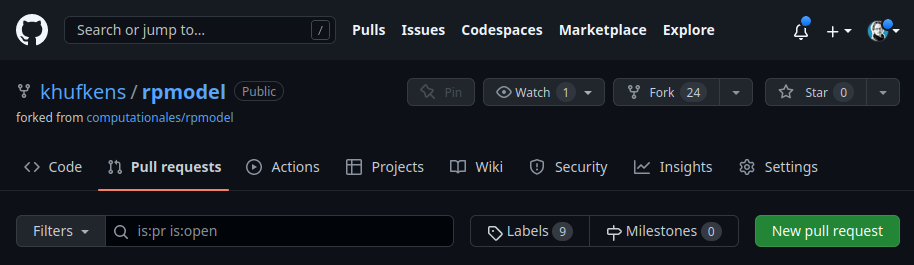
```

### Location based code management - github templates

Both code (and data) management require you to be conscientious about where you store your code (and data). Structuring your projects using the same template will allow you to understand where all pieces of an an analysis are stored. This has been mentioned in Chapter \@ref(openscience).

In our [R project template](https://github.com/geco-bern/R_proj_template), we provide a project structure for both data and code which removes the mental overhead of structuring data projects. This project structure sorts code, data and reporting in a consistent way.

You can use the template in combination with a GitHub-based version control approach to manage your projects. Simply create a new project from this template and clone the project to your local computer. Any changes to the project can be tracked by the workflows described above.

To use the template, create a new repository on GitHub, as you otherwise would using the big green button. If you are in the project on GitHub, you can hit the green button top right (**Use this template**).

```{r label="projecttemplate", echo=FALSE, fig.cap="Use a github project as a template", out.width="80%", fig.align='center'}
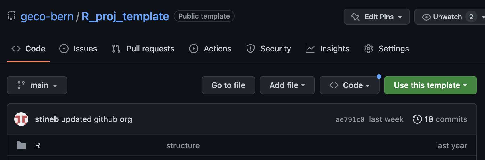
```

Otherwise, you can select the repository from the template dropdown menu, select `geco-bern/R-project-template`. 

```{r label="newtemplaterepository", echo=FALSE, fig.cap="Using a new template based repository", out.width="60%", fig.align='center'}
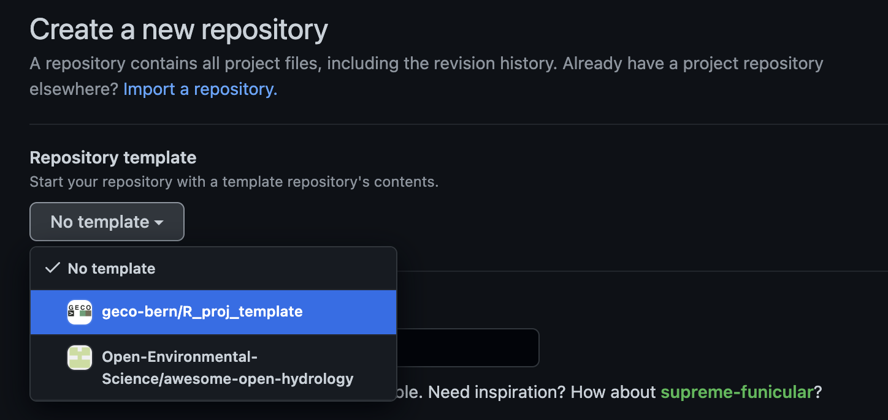
```

Proceed as usual by naming your repository. However, be careful to select the correct owner of the project if you have multiple identities. Rename the default `.Proj` file.

```{r label="newtemplaterepositoryname", echo=FALSE, fig.cap="Assigning a new template based repository", out.width="60%", fig.align='center'}
knitr::include_graphics("https://github.com/bluegreen-labs/environmental_data_science_101/raw/main/images/new_repo_2.png")
```

You can now clone the project to your local computer and continue to populate it with code and data.

## Exercises

### Location based code management {-}

Create a new R project using the *git* R project template shown above.

-   Make some changes to the README.md

-   Put a small data set in the appropriate directory.

-   Make sure that both local and remote repositories (projects) are synced.

## Report Exercises

### Collaborative Work on Github {-}

This is a team exercise, so team up with someone else in the classroom. You will learn about how to collaborate online using *git* and Github. 

> Important: When creating your repositories, make sure that you set the repository to be public and not private.

-  Person 1 - Create a new repository (can be the same as you created following the tutorial but should no be the same as the one where you hand in your report)

-  Person 2 - Fork the GitHub project that Person 1 created in Step 1.

-  Person 2 - Create a new file in this project

-  Person 2 - Commit and push these changes to this project. Create a **pull request** to the original project of Person 1.

-  Person 1 - Review the pull request from Person 2. Provide some comments, accept the pull request, letting it the new code by Person 2 be integrated into the project.

-  Person 1 - Add a new file to your own project, and update the GitHub project.

-  Person 2 - Sync your forked project to integrate the changes made by Person 1 into your own repository.

-  *Voluntary:* Can you force a merge conflict, for example by editing the same file at once, and resolve?

To complete the exercise, reverse rolls between Person 1 and Person 2.

### Deliverables for the report {.unnumbered}

This pair-coding exercise is part of your final performance assessment.  We will check each repositories' commit history to see whether this pair-coding exercise was done correctly. So, follow the steps above precisely!

When you submit your report by mail at the end of the course, you have to provide the links to your GitHub account, to your report repositories that holds all other report exercises, and to the two repositories that you created during this pair-coding work exercise (your repository that your friend forked and the repository that you forked from your friend). Alternatively you can also create a `./vignettes/re_paircoding.Rmd` in your report repository, where you provide these links.