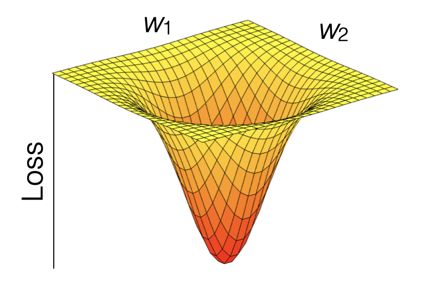
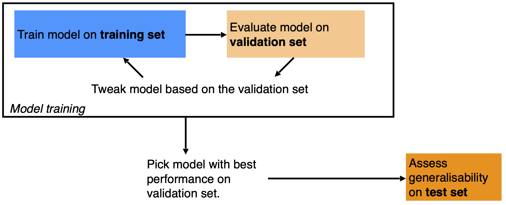

# Supervised machine learning II {#supervisedmlii}

**Chapter lead author: Benjamin Stocker**

## Learning objectives

In the Chapter \@ref(supervisedmli), you learned how the data are pre-processed, the model fitted, and how the model's generasbility to unseen data is tested. In the exercises of Chapter \@ref(supervisedmli), you learned how the bias-variance trade-off of a model, a KNN, can be controlled and that the choice of model complexity has different implications of the model's performance on the training and the test sets. A "good" model generalises well. That is, it performs well on unseen data.

In this chapter, you will learn more about the process of model training, the concept of the *loss*, and how we can chose the right level of model complexity for optimal model generalisability as part of the model training step. This completes your set of skills for your first implementations a supervised machine learning workflow.

## Tutorial

### Data and the modelling challenge

We're using the same data and address the same modelling challenge as in Chapter \@ref(supervisedmli). Let's load the data, wrangle a bit, specify the same model formulation, and the same pre-processing steps as in the previous Chapter \@ref(supervisedmli).

```{r warning=FALSE, message=FALSE}
daily_fluxes <- readr::read_csv("./data/FLX_CH-Dav_FLUXNET2015_FULLSET_DD_1997-2014_1-3.csv") |>  
  
  # select only the variables we are interested in
  dplyr::select(TIMESTAMP,
                GPP_NT_VUT_REF,    # the target
                ends_with("_QC"),  # quality control info
                ends_with("_F"),   # includes all all meteorological covariates
                -contains("JSB")   # weird useless variable
                ) |>

  # convert to a nice date object
  dplyr::mutate(TIMESTAMP = lubridate::ymd(TIMESTAMP)) |>

  # set all -9999 to NA
  dplyr::mutate(across(where(is.numeric), ~na_if(., -9999))) |> 

  
  # retain only data based on >=80% good-quality measurements
  # overwrite bad data with NA (not dropping rows)
  dplyr::mutate(GPP_NT_VUT_REF = ifelse(NEE_VUT_REF_QC < 0.8, NA, GPP_NT_VUT_REF),
                TA_F           = ifelse(TA_F_QC        < 0.8, NA, TA_F),
                SW_IN_F        = ifelse(SW_IN_F_QC     < 0.8, NA, SW_IN_F),
                LW_IN_F        = ifelse(LW_IN_F_QC     < 0.8, NA, LW_IN_F),
                VPD_F          = ifelse(VPD_F_QC       < 0.8, NA, VPD_F),
                PA_F           = ifelse(PA_F_QC        < 0.8, NA, PA_F),
                P_F            = ifelse(P_F_QC         < 0.8, NA, P_F),
                WS_F           = ifelse(WS_F_QC        < 0.8, NA, WS_F)) |> 

  # drop QC variables (no longer needed)
  dplyr::select(-ends_with("_QC"))

# Data splitting
set.seed(123)  # for reproducibility
split <- rsample::initial_split(daily_fluxes, prop = 0.7, strata = "VPD_F")
daily_fluxes_train <- rsample::training(split)
daily_fluxes_test <- rsample::testing(split)

# The same model formulation is in the previous chapter
pp <- recipes::recipe(GPP_NT_VUT_REF ~ SW_IN_F + VPD_F + TA_F, 
                      data = daily_fluxes_train) |> 
  recipes::step_center(recipes::all_numeric(), -recipes::all_outcomes()) |>
  recipes::step_scale(recipes::all_numeric(), -recipes::all_outcomes())
```

> To reproduce this code chunk, you can download the file `FLX_CH-Dav_FLUXNET2015_FULLSET_DD_1997-2014_1-3.csv` from [here](https://raw.githubusercontent.com/geco-bern/agds/main/data/FLX_CH-Dav_FLUXNET2015_FULLSET_DD_1997-2014_1-3.csv) and read it from the local path where the file is stored on your machine. All data files used in this tutorials are stored [here](https://github.com/geco-bern/agds/tree/main/data).

### Loss function {#training}

Model training in supervised machine learning is guided by the match (or mismatch) between the predicted and observed target variable(s), that is, between $\hat{Y}$ and $Y$. The *loss* function quantifies this mismatch ($L(\hat{Y}, Y)$), and the algorithm ("optimiser" in Fig. 10.1 of Chapter \@ref(supervisedmli)) takes care of progressively reducing the loss during model training.

Let's say the machine learning model contains two parameters and predictions can be considered a function of the two ($\hat{Y}(w_1, w_2)$). $Y$ is actually constant. Thus, the loss function is effectively a function $L(w_1, w_2)$. Therefore, we can consider the model training as a search of the parameter space to find the minimum of the loss. The parameter space spanned by all possible combinations of $(w_1, w_2)$. Common loss functions are the root mean square error (RMSE), or the mean square error (MSE), or the mean absolute error (MAE). Loss minimization is a general feature of ML model training.

```{r lossfunction, echo = FALSE, fig.cap="Visualization of a loss function.", fig.align='center'}

```

Model training is implemented in R for different machine learning algorithms in different packages. Some algorithms are even implemented by multiple packages. As described in Chapter \@ref(#supervisedmli), the {caret} package provides "wrappers" that handle a large selection of different machine learning model implementations in different packages with a unified interface (see [here](https://topepo.github.io/caret/available-models.html) for an overview of available models). The {caret} function `train()` is the center piece also in terms of specifying the loss function as the argument `metric`. It defaults to the RMSE for regression models and the accuracy for classification. 

### Hyperparameters

Practically all machine learning algorithms have some "knobs" to turn for controlling a model's complexity and other features of the model training. The optimal choice of these "knobs" is to be found for efficient model performance. Such "knobs" are the *hyperparameters*. Each algorithm comes with its own, specific hyperparameters.

For KNN, `k` is the (only) hyperparameter. It specifies the number of neighbours to consider for determining distances. There is always an optimum $k$. Obviously, if $k = n$, we consider all observations as neighbours and each prediction is simply the mean of all observed target values $Y$, irrespective of the predictor values. This cannot be optimal and such a model is likely underfit. On the other extreme, with $k = 1$, the model will be strongly affected by the noise in the single nearest neighbour and its generalisability will suffer. This should be reflected in a poor performance on the validation data.

Hyperparameters usually have to be "tuned". The optimal setting depends on the data and can therefore not be known *a priori*. Below is a visualisation of the loss (MAE) on the training and on the test set for different choices of $k$.

```{r eval=TRUE, include=FALSE}
# load our custom evaluation function
source("R/eval_model.R")

# specify the set of K
df_k <- data.frame(k = c(2, 5, 10, 15, 20, 25, 30, 35, 40, 60, 100, 200, 300)) |> 
  dplyr::mutate(idx = 1:dplyr::n())
```

<!-- >>> CHECK FOR REDUCING COMPUTATIONAL COST TO RENDER BOOK ONLINE <<< -->
<!-- SAVE DATA WHEN RUNNING LOCALLY BY SETTING EVAL = TRUE, PUSH ONLY WITH EVAL = FALSE -->
```{r eval=FALSE, include=FALSE}
# model training for the specified set of K
list_mod_knn <- purrr::map(
  df_k$k,
  ~caret::train(pp, 
                data = daily_fluxes_train |> tidyr::drop_na(), 
                method = "knn",
                trControl = caret::trainControl(method = "none"),
                tuneGrid = data.frame(k = .),   # '.' evaulates k
                metric = "RMSE"))
```

```{r include=FALSE, eval=FALSE}
# Use this only to by-pass running cross-validation when rendering book online
saveRDS(list_mod_knn, "data/tutorials/smlii_list_mod_knn.rds")
```

```{r include=FALSE}
# Load data when rendering book online
list_mod_knn <- readRDS("data/tutorials/smlii_list_mod_knn.rds")
```
<!-- >>> END OF CHECK <<< -->

```{r, include=FALSE}
# Evaluate all models
list_metrics <- purrr::map(
  list_mod_knn,
  ~eval_model(., 
              daily_fluxes_train |> drop_na(), 
              daily_fluxes_test, 
              return_metrics = TRUE))
# extract metrics on training data
list_metrics_train <- purrr::map(
  list_metrics,
  "train") |> 
  # add K to the data frame
  bind_rows(.id = "idx") |> 
  mutate(idx = as.numeric(idx)) |> 
  left_join(df_k, by = "idx")

# extract metrics on testing data
list_metrics_test <- purrr::map(
  list_metrics,
  "test") |> 
  # add K to the data frame
  bind_rows(.id = "idx") |> 
  mutate(idx = as.numeric(idx)) |> 
  left_join(df_k, by = "idx")
```


```{r, echo=FALSE}
# prepare for visualisation
df_mae <- list_metrics_train |> 
  filter(.metric == "mae") |> 
  mutate(set = "train") |> 
  bind_rows(
    list_metrics_test |> 
      filter(.metric == "mae") |> 
      mutate(set = "test")
  )

# visualise
df_mae |> 
  ggplot(aes(x = k, y = .estimate, color = set)) +
  geom_point() +
  geom_line()
```

This illustrates that the model performance on the training set keeps improving as the model variance (as opposed to bias) increases - here as we go towards smaller $k$. However, what counts for measuring out-of-sample model performance is the evaluation on the test set, which deteriorates with increasing model variance beyond a certain point.

Although decisive for the generalisability of the model, we cannot evaluate its performance on the test set during model training. We have set that data aside and must leave it untouched to have a basis for evaluating the model performance on unseen data after training. What can we do to determine the optimal hyperparameter choice during model training, estimating its performance on the test set?

### Resampling {#resampling}

The solution is to split the training data again - now into a training and a *validation* set. Using the validation set, we can "mimick" out-of-sample predictions during training by determining the loss on the validation set and use that for guiding the model training. However, depending on the volume of data we have access to, evaluation metrics determined on the validation set may not be robust. Results may vary depending on the split into training and validation data. This makes it challenging for reliably estimating out-of-sample performance.

A solution for this problem is to *resample* the training data into a number training-validation splits, yielding several pairs of training and *validation* data. Model training is then guided by minimising the average loss determined on the different resamples. Having multiple resamples (multiple *folds* of training-validation splits) avoids the loss minimization from being misguided by random peculiarities in the training and/or validation data.

Whether or not a resampling is applied, depends on the data volume and computational costs of the model training which increase linearly with the number of resamples. For models that take days-weeks to train, resampling is not a realistic option. However, for many machine learning applications in Geography and Environmental Sciences, models are much less costly and resampling is viable and desirable approach to model training. 

The most important methods of resampling are **bootstrapping** (not explained here, but see [Boehmke and Greenwell (2020)](https://bradleyboehmke.github.io/HOML/process.html)) and **k-fold cross validation**. An advantage of bootstrapping is that it provides an estimation of the distribution of the training error (without the need for data distribution assumptions because it's non parametric), which informs not only the magnitude of the training error but also the variance of this estimate. Nevertheless, this statistical approach can become very computationally intensive because it needs many resamples with replacement and model runs. Hence cross validation lends itself more to model training.

In *k-fold cross validation*, the training data is split into *k* equally sized subsets (*folds*). (Don't confuse this k with the k in KNN.) Then, there will be *k* iterations, where each fold is used for validation once (while the remaining folds are used for training). An extreme case is *leave-one-out cross validation*, where *k* corresponds to the number of data points.

```{r kfoldcv, echo = FALSE, fig.cap="K-fold cross validation. From Boehmke and Greenwell (2020).", fig.align='center'}
knitr::include_graphics("figures/cv.png")
```

To do a k-fold cross validation during model training in R, we don't have to implement the loops around folds ourselves. The resampling procedure can be specified in the {caret} function `train()` with the argument `trControl`. The object that this argument takes is the output of a function call to `trainControl()`. This can be implemented in two steps. For example, to do a 10-fold cross-validation, we can write:

<!-- >>> CHECK FOR REDUCING COMPUTATIONAL COST TO RENDER BOOK ONLINE <<< -->
<!-- SAVE DATA WHEN RUNNING LOCALLY BY SETTING EVAL = TRUE, PUSH ONLY WITH EVAL = FALSE -->

```{r eval=FALSE}
set.seed(1982)
mod_cv <- caret::train(pp, 
                       data = daily_fluxes_train |> drop_na(), 
                       method = "knn",
                       trControl = caret::trainControl(method = "cv", number = 10),
                       tuneGrid = data.frame(k = c(2, 5, 10, 15, 20, 25, 30, 35, 40, 60, 100)),
                       metric = "MAE")
```

```{r include=FALSE, eval=FALSE}
# Use this only to by-pass running cross-validation when rendering book online
saveRDS(mod_cv, "data/tutorials/smlii_mod_cv.rds")
```

```{r include=FALSE}
# Load data when rendering book online
mod_cv <- readRDS("data/tutorials/smlii_mod_cv.rds")
```
<!-- >>> END OF CHECK <<< -->

```{r out.width="80%"}
# generic plot of the caret model object
ggplot(mod_cv)

# generic print
print(mod_cv)
```

From the output of `print(mod_cv)`, we get information about model performance for each hyperparameter choice. The values reported are means of respective metrics determined across the ten folds. Also the optimal choice of $k$ (25) is reported. Does this correspond to the $k$ with the best performance determined on the test set? If resampling was a good approach to estimating out-of-sample model performance, then it should!

```{r}
df_mae |>    # see hint
  filter(set == "test") |> 
  filter(.estimate == min(.estimate))
```

> The object `df_mae` is created above, recording metrics determined on the training and the validation set for differen choices of $k$. The respective code is hidden for the book. Explore the source code [here](https://github.com/geco-bern/agds/blob/3fc03645cf4831ebf29dc0fcce4d032d01fced8a/10-supervised_ml_II.Rmd#L147).

The evaluation on the test set suggests that $k=30$ is optimal, while 10-fold cross-validation yielded an optimal $k = 25$. Apparently, cross-validation suggested a model that is slightly more on the variance side along the bias-variance trade-off than the evaluation on the test set did. This (relatively small) mismatch is probably a result of randomness in the data.

Let's look at the results as we did in Chapter \@ref(supervisedmli). The model object `mod_cv` contains information about the whole hyperparameter search and also about the choice of the best hyperparameter value. When using the object in the `predict()` function (as used inside `eval_model()`), it automatically uses the model trained with the optimal $k$.

```{r}
eval_model(mod = mod_cv, df_train = daily_fluxes_train, df_test = daily_fluxes_test)
```

Remember that in Chapter \@ref(supervisedmli), we used $k=8$ and got an $R^2=0.72$ on the training set and $R^2=0.64$ on the test set. The results with the optimal choice of $k=25$ yield an $R^2=0.69$ on the training set and $R^2=0.65$ on the test set - poorer than with $k=8$ on the training set but slightly better on the test set.

### Validation versus testing data

A source of confusion can be the distinction of validation and testing data. They are different things. The validation data is used during model training. The model fitting and the selection of the optimal hyperparameters is based on comparing predictions with the validation data. Hence, evaluations of true out-of-sample predictions should be done with a portion of the data that has never been used during the model training process (see Figure \@ref(fig:trainvaltest)).

```{r trainvaltest, echo = FALSE, fig.cap="Figure adopted form [Google Machine Learning Crash Course](https://developers.google.com/machine-learning/crash-course/validation/video-lecture).", out.width="80%", fig.align='center'}

```

### Modeling with structured data

A fundamental assumption underlying many machine learning algorithms and their training setup is that the data are *independent and identically distributed (iid)*. This means that each observation is generated by the same process, follows the same distribution, and is independent from its neighboring point or any other data point. This assumption is often made in statistical models to simplify the analysis and to ensure the validity of various mathematical results used in machine learning algorithms. In reality, this is often not satisfied. In Chapter \@ref(datawrangling), we dealt with structure in the data in the context of formatting and aggregating data frames. Such structures are often also relevant for modelling and what it means for a model to "generalize well". Remember that structure in data arises from similarity of the subjects generating the data. Such structures and their relation to the modelling task should be considered when choosing the model algorithm, formulating the model, and when implementing the training a testing setup.

Consider, for example, the time series of ecosystem fluxes and meterological covariates in our dataset `daily_fluxes`. When using this data to train a KNN or a linear regression model, we implicitly assume that the data is *iid*. We assumed that there is a true function $f(X)$ that generates the target data $Y$ and that can be used to predict under any novel condition $X_\text{new}$. However, in reality, this may not be the case. $f(X)$ may change over time. For example, over the course of a season, the physiology of plants changes (think phenology) and may lead to temporally varying relationships between $X$ and $Y$ that are not captured by temporal variations in $X$ itself - the relationships are not stationary.

Working with geographic and environmental data, we often deal with *temporal dependencies* between predictors and the target data. In our data `daily_fluxes` of ecosystem fluxes and meteorological covariates, this may be, as mentioned, arising from phenological changes in plant physiology and structure, or caused by a lasting effects weather extremes (e.g., a late frost event in spring). In hydrological data, temporal dependencies between weather and streamflow are generated by catchment characteristics and the runoff generation processes. Such temporal dependencies violate the independence assumption. Certain machine learning algorithms (e.g., recurrent neural networks) offer a solution for such cases and are suited for modelling temporal dependencies or, in general, sequential data where the order of the records matters (e.g., language models that consider the order of words in a text). Training-testing and cross-validation splits for sequential data have to preserve the order of the data in the subsets. In this case, the splits have to be done by *blocks*. That is, model generalisability is to be assessed by training on one block of the time series and testing on the remaining block. Note that the splitting method introduced in Chapter \@ref(supervisedmli) using `rsample::initial_split()` assumes that the data is *iid*. In the function, data points are randomly drawn and allocated to either the test or the training subset. It is therefore not applicable for splitting data with temporal dependencies. Modelling temporal dependencies will be dealt in future (not currently available) chapters of this book.

Other dependencies may arise from the *spatial context.* For example, a model for classifying an atmospheric pressure field as a high or a low pressure system uses information about the spatial arrangement of the data - in this case raster data. A model predicts one value ('high pressure system' or 'low pressure system') per pressure field. Such modelling tasks are dealt with yet another class of algorithms (e.g., convolutional neural networks).

Spatial or group-related structure in the data may arise if, in general, the processes generating the data, cannot be assumed to be identical and lead to identically distributed data across groups. For example, in the data `daily_fluxes_allsites_nested_joined` from Chapter \@ref(datawrangling), time series of ecosystem fluxes and meteorological covariates are provided for a set of different sites. There, the group structure is linked to site identity. Similarly, streamflow data may be available for multiple catchments. However, considering the between-catchment variations in soil, terrain, vegetation, and geology, a model may not yield accurate predictions when trained by data from one catchment and applied to a different catchment.

To evaluate model generalisability to a new site or catchment (not just a new time step within a single site or catchment), this structure has to be taken into consideration. In this, case, data splits of training and validation or testing subsets are to be separated along blocks, delineated by the similar groups of data points (by sites, or by catchments). That is, training data from a given site (or catchment) should be either in the training set or in the test (or validation) set, but not in both.

This illustrates that the data structure and the modelling aim (generalisability in what respect?) have to be accounted for when designing the data split and resampling strategy. The {caret} function `groupKFold()` offers the solution for such cases, creating folds for cross-validation that respect group delineations. In other cases, such grouping structure may not be evident and may not be reflected by information accessible for modelling. For example, we may be able to separate time series from different sites but we don't know whether sites are sufficiently independent to be able to consider the test metric to reflect the true uncertainty in predicting to an entirely new location which is neither in the test nor training set. In such cases, creative solutions have to be found and appropriate cross-validations have to be implemented with a view to the data structure and modelling aim.

## Exercises

### Cross-validation by hand {-}

In the tutorial we "built on shoulder of giants" - people that went through the struggle of writing a robust package to implement a cross validation. Although we can and should use such packages, we still have to understand how a cross validation works in detail. 

Write a function that implements *n*-fold cross-validation for KNN with $k=30$. (We write 'n-fold CV' here to avoid confusion with the k in KNN, but mean the same as described in Section \@ref(resampling).) The function should take as arguments the training data object, *n* for specifying the number of folds (use $n=60$), the name of the target variable, the names of the predictor variables as a character vector, and the $k$ for KNN. The function should return a vector of length *n*, containing the MAE evaluated on the *n* folds. To randomize the split of data points into folds, first "re-shuffle" the rows in the training data as part of the function. Centering and scaling of the training and validation data should be applied manually before getting the KNN model object within each fold.

As data, use daily ecosystem flux data from [here](./data/df_daily_exercise_supervisedmlii.csv). As target variable, use `"GPP_NT_VUT_REF"`. As predictor variables, use `c("TA_F", "SW_IN_F", "VPD_F")`.

Visualise the distribution of the validation errors (MAE) across folds.

> Hint: Center and scale the predictors (but not the target data) within each fold.

> Hint: Use `read.csv()` to obtain a "nude" data frame (not a tibble) and use the syntax `df[,"variable_name"]` to extract a vector from a data frame. This makes your life easier.

> Hint: To determine the row indices to be allocated to each fold, you may find a solution using the base-R function `split()` or you may use `caret::createFolds()`.

> Hint: Write two functions: One as asked for above and one that implements steps that are carried out repeatedly for each fold, given row indices of the validation set of the respective fold.

> Hint: Since you are doing the cross-validation "by hand" and perform no hyperparameter tuning, we don't need the `caret::train()` function. Instead, use `caret::knnreg(x, y, ...)` for creating the model object on the training data (with `x` and `y` being data frames) and the generic `predict()` for predicting on the validation set within each fold.

### Cross-validation vs. test error

Now, you can use the user-friendly `caret::train()` for KNN with 60-fold cross-validation and tuning the hyperparameter k. Use the MAE as the loss metric. Use the same data as in the Exercise above and withhold 20% of the data for the test set. Visually compare the reported mean MAE from the cross-validation folds with the MAE determined on a test set.

In your visual comparison, add a plot layer showing the distribution of validation errors from you manual implementation of cross-validation (Exercise above).

> Hint: The returned model object from a `caret::train()` call is a list with fold-wise metrics in its element `results`.

## Report Exercise

Here, we explore the role of structure in the data for model generalisability and how to best estimate a "true" out-of-sample error that corresponds to the prediction task. The task here is to train a KNN-model on ecosystem flux observations from one site and predict to another site. In previous examples and exercises, we always trained and predicted within the same site. How well is a model generalisable to a new site; can we use our model for spatial upscaling? Solve these task and save your reproducible solution in `./vignettes/re_ml02.rmd` (don\`t forget to upload the data and html):

1.  To investigate the concept of generalisability, we use flux data from two sites: [Davos (CH-Dav)](https://fluxnet.org/sites/siteinfo/CH-Dav) (`FLX_CH-Dav_FLUXNET2015_FULLSET_DD_1997-2014_1-3.csv`), and [Laegern (CH-Lae)](https://fluxnet.org/sites/siteinfo/CH-Lae) (`FLX_CH-Lae_FLUXNET2015_FULLSET_DD_2004-2014_1-4.csv`). Gather information on the characteristics of these sites - how do they differ regarding climate, vegetation, altitude, etc.

2.  Train three KNN-models on each dataset: Davos only, Laegern only, both together. For each model: Use 80% of the data to train a KNN-model with an optimal $k$ and set aside the remaining 20% for testing.

3.  Test your models on each of the three test datasets that you set aside. Create three tables (see example below), one for each model and display the evaluation metrics on all test sets.

**Example table:**

|                                             |       |        |
|---------------------------------------------|-------|--------|
| Model trained on data from [insert sitename/s]              | $R^2$ | $RMSE$ |
| Evaluation against Laegern test set         |       |        |
| Evaluation against Davos test set           |       |        |
| Evaluation against Laegern & Davos test set |       |        |

4.  Use your knowledge on statistical learning and on the different sites to answer the following questions:

    -   What are the patterns that you see in the tables?
    
    -   How well do models trained on one site perform on another site? Why is this the case?
    
        -   To answer this think of the differences between the sites! Interpret the models' biases on the out-of-sample prediction with respect to the site's charactersitics. Perhaps you could identify such biases by comparing the time-series of both models on the same test set?
    
    -   How does the model trained on both sites perform on the three test sets? Why is this the case?
    
    -   When training and testing on both sites, is this a true 'out-of-sample' setup? What would you expect if your model was tested against data from a site in Spain?

> Hint: To make the models comparable, make sure that you are using the same variables during training. Check your data before you start modelling!

> Hint: Do not produce multiple "Training-Test" plots shown throughout this course. Find a way to convey your message in concise way and pick these plots only when you really need them to support you answer.

> Hint: Consult the [RMarkdown cheatsheet](https://raw.githubusercontent.com/rstudio/cheatsheets/main/rmarkdown-2.0.pdf) or other online resources to learn how to create a Markdown table.

### Deliverables for the report {.unnumbered}

Present your solutions in a file called `re_ml02.Rmd`, save it in your `vignettes` folder alongside the HTML version, and make sure that your code is reproducible (make sure your .rmd is knittable, that all data is available, that paths to that data work, etc.).