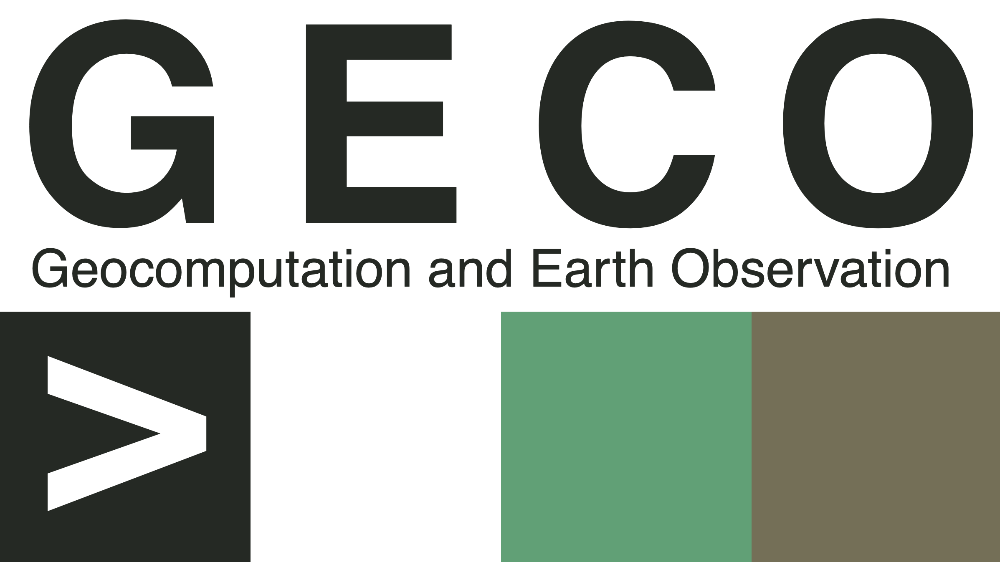
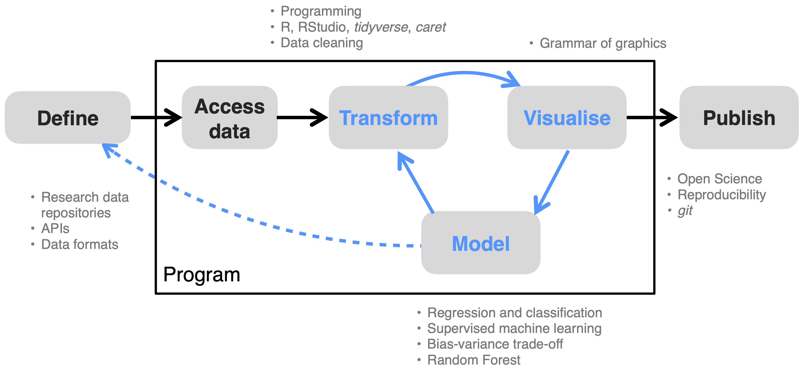

```{r}
knitr::opts_chunk$set(fig.align="center")
```

# Overview {.unnumbered}

## About this book {.unnumbered}

This book serves as the basis for the series of courses in *Applied Geodata Science*, taught at the Institute of Geography, University of Bern. The starting point of this book were the tutorials edited by Benjamin Stocker, Loïc Pellissier, and Joshua Payne for the course *Environmental Systems Data Science* (D-USYS, ETH Zürich). The present book was written as a collaborative effort led by [Benjamin Stocker](https://geco-group.org/author/benjamin-stocker/), with contributions by [Pepa Aran](https://geco-group.org/author/pepa-aran/) and [Koen Hufkens](https://geco-group.org/author/koen-hufkens/), and exercises by [Pascal Schneider](https://geco-group.org/author/pascal-schneider/).

The target of this book are people interested in applying data science methods for research. Methods, example data sets, and prediction challenges are chosen to make the book most relatable to scientists and students in Geography and Environmental Sciences. No prior knowledge of coding is required. Respective essentials are briefly introduced as primers. The focus of this book is not on the theoretical basis of the methods. Other "classical" statistics courses serve this purpose. Instead, this book introduces essential concepts, methods, and tools for applied data science in Geography and Environmental Sciences with an emphasis on covering a wide breadth. It is written with a hands-on approach using the R programming language and should enable an intuitive understanding of concepts with only a minimal reliance on mathematical language. Worked examples are provided for typical steps of data science applications in Geography and Environmental Sciences. The aim of this book is to teach the diverse set of skills needed as a basis for data-intensive research in academia and outside.

We also use this book as a reference and on-boarding resource for group members of [Geocomputation and Earth Observation (GECO)](https://geco-group.org/), at the Institute of Geography, University of Bern.

<br>

Images and other materials used here were made available under non-restrictive licenses. Original sources are attributed. Content without attribution is our own and shared under the license below. If there are any errors or any content you find concerning with regard to licensing or other, please [contact us](https://geco-group.org/contact/). Any feedback, positive or negative, is welcome and can be posted [here](https://github.com/stineb/agds/issues).

<a rel="license" href="http://creativecommons.org/licenses/by-nc/4.0/"></a><br />This work is licensed under a <a rel="license" href="http://creativecommons.org/licenses/by-nc/4.0/">Creative Commons Attribution-NonCommercial 4.0 International License</a>.

<br>

{width="30%"} {width="30%"}

------------------------------------------------------------------------

## About this course {.unnumbered}

This book contains the lecture notes and exercises for the following courses, offered for Geography and for Climate Sciences students at the University of Bern, Switzerland:

**Applied Geodata Science I**

This is a course for Bachelors students in their second or third year of studies in Geography.

-   Chapters \@ref(gettingstarted) to Chapter \@ref(randomforest)

**Applied Geodata Science II**

This is a course for Master students in Geography or Climate Sciences. Chapters in development.


### Course goal {.unnumbered}

The overall goal of this set of courses is that students and other readers learn to **tell a story with (environmental and geo-) data**.

### Learning Objectives {.unnumbered}

The overall learning objectives are:

-   Design and communicate your research project as a reproducible workflow.
    -   Find, access, process, and visualise large environmental and geographic data.
    -   Write legible code and manage collaborative code and data-centered projects.
    -   Manage analysis code for long-term reproducibility.
-   Identify, quantify, and interpret patterns in large environmental and geographic data.
    -   Devise suitable data visualisations.
    -   Determine suitable model formulations and implement effective model training.
    -   Describe the challenges of model fitting with large data.
-   Implement and make use of Open Science practices and resources to support data science projects in Geography and Environmental Sciences.

### Course contents {.unnumbered}

This course covers all steps along the data science workflow (see Fig. \@ref(fig:datascienceworkflow)) and introduces methods and tools to learn the most from data, to effectively communicate insights, and to make your workflow reproducible. By following this course, you will be well equipped for joining the Open Science movement.

```{r label="datascienceworkflow", echo=FALSE, fig.cap="The data science workflow and keywords of contents covered in Applied Geodata Science I. Figure adapted from: [Wickham & Grolemund *R for Data Science*](https://r4ds.had.co.nz/index.html)"}

```

This chapter starts by providing the context for this course: Why Applied Geodata Science? Why now?

Chapters \@ref(gettingstarted) and \@ref(programmingprimers) serve as primers to get readers with a diverse background and varying data science experience up to speed with the basics for programming in R, which we rely on in later chapters.

Chapter \@ref(datawrangling) introduces efficient handling and cleaning of large tabular data with the R *tidyverse* "programming dialect". The focus is on non-geospatial data. Closely related to transforming data and its multiple axes of variation is data visualisation, covered in Chapter \@ref(datavis).

Chapters \@ref(datavariety), \@ref(codemgmt), and \@ref(openscience) introduce essential tools for the daily work with diverse data and for an Open Science practice.

With Chapters \@ref(regressionclassification), Chapter \@ref(supervisedmli), Chapter \@ref(supervisedmlii), and Chapter \@ref(randomforest), we will get into modelling and identifying patterns in the data.

Chapters \@ref(gettingstarted)-\@ref(randomforest) serve as lecture notes for *Applied Geodata Science I* and as learning material for students and scientists in any data-intensive research domain. These chapters are not explicitly dealing with geospatial data and modelling. Modelling with geospatial and temporal data is the subject of the course *Applied Geodata Science II* and will be introduced with a focus on typical applications and modelling tasks in Geography and Environmental Sciences. Respective materials are not currently contained in this book but will be added here later.

All tutorials use the R programming language.

# Introduction {.unnumbered}

The sheer volume of data that is becoming available today bears a huge potential for answering long-standing questions in all fields of environmental and geo-sciences. This gives rise to a new set of tools that can be used and a new set of challenges when applying them.

## What is Applied Geodata Science? {.unnumbered}

Data science is interdisciplinary by nature. It sits at the intersection between domain expertise, Statistics and Mathematics knowledge, and coding skills. Data science generates new insights for applications in different fields by combining these three realms (Fig. \@ref(fig:datasciencevenn)). Combining only two of the three realms falls short of what data science is [(Conway, 2013)](http://drewconway.com/zia/2013/3/26/the-data-science-venn-diagram).

```{r label="datasciencevenn", echo=FALSE, out.width="50%", fig.cap="The Venn diagram of data science. Adapted from [Conway, 2013](http://drewconway.com/zia/2013/3/26/the-data-science-venn-diagram)."}
knitr::include_graphics("./figures/data_science_venn_mine.png")
```

Dealing with data requires coding (but not a degree in computer science). Coding skills are essential for file and data manipulation and for thinking algorithmically. 

Basic knowledge in Statistics and Mathematics are needed for extracting insights from data and for applying appropriate statistical methods. An overview of methods, a general familiarity, and an intuitive understanding of the basics are more important for most data science projects than having a PhD in Statistics. 

Statistics plus data yields machine learning, but not "data science". In data science, questions and hypotheses are motivated by the scientific endeavor in different domains or by applications in the public or private sectors. To emphasize the distinctively applied and domain-oriented approach to data science of this course, we call it **Applied Geo**data Science.

Of course, empirical research has always relied on data. The essential ingredient of a course in (Applied Geo-) data science is that it emphasizes the methodological aspects that are unique and critical for data-intensive research in Geography and Environmental Sciences, and for putting Open Science into practice.

This course is also supposed to teach you how to stay out of the “danger zone” - where data is handled and models are fitted with a blind eye to fundamental assumptions and relations. The aim of data science projects is to yield credible ("trustworthy") and robust results.

## The data science workflow  {.unnumbered}

The red thread of this course is the *data science workflow* (Fig. \@ref(fig:datascienceworkflowslim)). Applied (geo-) data science projects typically start with research questions and hypotheses, and some data at hand, and (ideally) end with an answer to the research questions and the communication of results in textual, visual, and reproducible forms. What lies in between is not a linear process, but a cycle. One has to "understand" the data in order to identify appropriate analyses for answering the research questions. Before we've visualized the data, we don't know how to transform it. And before we've modeled it, we don't know the most appropriate visualization. In practice, we approach answers to our research questions gradually, through repeated cycles of *exploratory data analysis* - repeated cycles of transforming the data, visualizing it, and modelling relationships. More often than not, the exploratory data analysis generates insights about missing pieces in the data puzzle that we're trying to solve. In such cases, the data collection and modelling task may have to be re-defined (dashed line in Fig. \@ref(fig:datascienceworkflowslim)), and the exploratory data analysis cycle re-initiated.

```{r label="datascienceworkflowslim", echo=FALSE, fig.cap="The data science workflow. Figure adapted from: [Wickham & Grolemund *R for Data Science*](https://r4ds.had.co.nz/index.html)"}
knitr::include_graphics("./figures/data_science_workflow_simpl.png")
```

As we work our way through repeated cycles of exploratory data analysis, we take decisions based on our data analysis, modelling, and visualizations. And we write code. The final conclusions we draw, the answers to research questions we find, and the results we communicate rest on the combination of all steps of our data processing, analysis, and visualization. Simply put, it rests on the reproducibility (and legibility) of our code (encapsulated by 'Program' in Fig. \@ref(fig:datascienceworkflowslim)). 

## Why now? {.unnumbered}

Three general developments set the stage for this course. First, Geography and Environmental Sciences (as many other realms of today's world) have entered a **data-rich era** (Chapters \@ref(datavariety)). Second, **machine learning** algorithms have revolutionized the way we can extract information from large volumes of data (Chapters \@ref(supervisedmlii) - \@ref(randomforest)). Third, **Open Science** principles (Chapter \@ref(openscience)) - essential for inclusive research, boundless progress, and for diffusing science to society - are becoming a prerequisite for getting research funded and published. The skill set required to make use of the potentials of a data-rich world is diverse and is often not taught as part of the curriculum in the natural sciences (as of year 2023). This course fills this open space.

## A new modelling paradigm   {.unnumbered}

What is 'modelling'? Models are an essential part of the scientific endeavor. They are used for describing the world, explaining observed phenomena, and for making predictions that can be tested with data. Models are thus a device for translating hypotheses of how the world operates into a form that can be confronted with how the world is observed. 

Models can be more or less explicit and more or less quantitative. Models can come in the form of vague mental notions that underpin our view of the world and our interpretation of observations. Towards the more specific end of this spectrum, models can be visualizations. For example a visualization of how elements in a system are connected. At the arguably most explicit and quantitative end of the spectrum are models that rely on mathematical descriptions of how elements of a system are connected and how processes operate. Examples of such models include General Circulation Models of the climate system or models used for Numerical Weather Prediction. Such models are often referred to as *mechanistic models*.

A further distinction within mechanistic models can be made between *dynamic models* that describe a temporal evolution of a system (e.g., the dynamics of the atmosphere and the ocean in a General Circulation Model) and "static" models (e.g., a model for estimating the power generation of a solar photovoltaics station). In a dynamic model, we need to specify an initial state and the model (in many cases given additional inputs) predicts the evolution of the system from that. In a static model, the prediction can be described as a *function* of a set of inputs, without temporal dependencies between the inputs and the model prediction.

Often, mechanistic and *empirical models* are distinguished. Empirical models can be viewed as somewhere closer towards the less explicit end of the spectrum described above. In mechanistic models, the mathematical descriptions of relationships are informed by theory or by independently determined relationships (e.g., laboratory measurements of metabolic rates of an enzyme). In contrast, empirical models rely on no, or only a very limited amount of *a priori* knowledge that is built into the model formulation. However, it should be noted that mechanistic models often also rely on empirical or statistical descriptions for individual components (e.g., the parametrisation of convection in a climate model), and statistical models may, in some cases, also be viewed as a representation of mechanisms that is consistent with the theoretical understanding. A related example is the light use efficiency model (Monteith, 1972) that linearly relates vegetation productivity to the amount of absorbed solar radiation. It has the form of a bivariate linear regression model. Vice-versa, traditional statistical models also rely on assumptions regarding the data generating process(es) and the resulting distribution of the data.

*Supervised machine learning* models can be regarded as empirical models that are even further "assumption free" side than traditional statistical models. In contrast to mechanistic models where rules and hypotheses are explicitly and mathematically encoded, and in contrast to statistical models where assumptions of the data distribution are made for specifying the model, machine learning approaches modelling from the flip side: from the data to the insight [(Breiman, 2001)](https://projecteuclid.org/journals/statistical-science/volume-16/issue-3/Statistical-Modeling--The-Two-Cultures-with-comments-and-a/10.1214/ss/1009213726.full). Rules are not encoded by a human, but discovered by the machine. Machine learning models learn from *patterns in the data* for making new predictions, rather than relying on theory and *a priori* knowledge of the system. In that sense, machine learning follows a new modelling paradigm. The *learning* aspect in machine learning refers to the automatic search process and the guidance of the model fitting by some feedback signal (loss function) that are employed in machine learning algorithms (see also Chapter \@ref(supervisedmlii)).

The aspect of "patterns in the data" is key here. Often, these patterns are fuzzy. Rule-based algorithms have a limited capacity for dealing with such problems. *Symbolic artificial intelligence* is based on rules and underlies, for example, a computer playing chess [(Chollet & Allaire, 2018)](https://www.manning.com/books/deep-learning-with-r). However, where rules cannot be encoded from the outset, symbolic artificial intelligence has reached its limits. A breakthrough in learning from fuzzy patterns in the data has been enabled by deep learning. Through multiple layers of abstraction of the data, deep learning models identify underlying, abstract, relationships and use them for prediction. Deep learning has been extremely successful in solving problems, e.g., in image classification, speech recognition, or language translation. 

However, the abstraction comes at the cost of interpretability. Deep learning models and machine learning models in general are used with an emphasis on *prediction* and have seen particularly wide adoption in fields where a false prediction has acceptable consequences (An inappropriate book recommendation based on your previous purchases is not grave.) ([Knüsel et al., 2019](https://doi.org/10.1038/s41558-019-0404-1)). The model itself remains a black box and its utility for hypothesis testing is limited. This challenge has spurred the field of *interpretable machine learning*, where solutions are sought for uncovering the black box and proble the model for its trustworthiness.

Chapters \@ref(regressionclassification)-\@ref(randomforest) lead into the world of machine learning and introduce the essential steps of the modelling workflow without delving into deep learning. Together with its preceeding chapters, this completes the toolbox required for making the first data scientific steps for applications in Geography and Environmental Sciences. This may be only just the beginning...

## Reading and link collection  {.unnumbered}

**Foundations**

-   Leo Breiman. "Statistical Modeling: The Two Cultures (with comments and a rejoinder by the author)." Statist. Sci. 16 (3) 199 - 231, August 2001. <https://doi.org/10.1214/ss/1009213726>

    -   A paper describing the paradigm shift in statistical modelling - from traditional approaches to machine learning. Written in accessible language by the inventor of the Random Forest algorithm.
    
**Data wrangling**

- R4DS

**Data visualisation**

- asdf

**Machine learning**

-   HOML
-   Chollet & Allaire "Deep learning with R"

